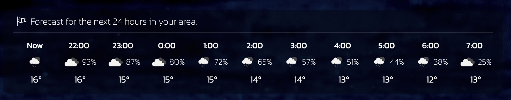

<p align="center">
  
</p>

<h1 align="center">Eye in the Sky</h3>

<p align="center"><i>Keep an eye on the skies as if you were the god of meteorology.</i></p>

<p align="center">
  <a href="https://github.com/Rod-Freedom/C6-Eye_in_the_Sky/blob/main/LICENSE"></a>
</p>

<br>
<br>

## **ABOUT THE PROJECT**
### **Overview**
Observe the skies and keep the weather in check.

***Eye in the Sky*** is an intuitive weather app that allows you to plan your day and trips.
You'll love the city autocomplete feature, which will allow you to find any city in the world.
The design will give you a feeling of peace while you check all the info about the weather.

*Find the repo [here](https://github.com/Rod-Freedom/C6-Eye_in_the_Sky).*<br>
*Watch our tutorial [here](https://youtu.be/KGUw7XCQuS4?feature=shared)!*<br>
*Go to the site [here](https://rod-freedom.github.io/C6-Eye_in_the_Sky/)!*

<br>
<br>

## Table of Contents
- [License](#license)
- [Resources](#resources)
- [Get Started](#get-started)
- [Usage](#usage)
- [Demos](#demos)
- [Testing](#testing)
- [Contribute](#contribute)
- [Credits](#credits)

<br>

[(Back to the Top)](#about-the-project)

## Resources
* For the HTML:
    * Added Tailwind framework.
    * Favicon.
    * Forced dark mode.
    * Google fonts.
    * Meta description.
    * `defer` attribute.
    * `type="module"` scripts.
* For the CSS:
    * Tailwind.
    * Tailwindcss `@apply`.
    * Intuitive classes.
    * `::after` and `::before` art.
    * ```Calc()``` sizes for responsiveness.
    * Transitions.
    * `aspect-ratio` media queries.
    * `max-width` media queries.
* For JavaScript
    * ES6 modules.
    * Promises.
    * Extensive object and array destructuring.
    * Polymorphism for methods.
    * Classes and constructors.
    * Extended classes.
    * `static` methods.
    * `AbortSignal.abort()` to remove event listeners.
    * Event listeners.
    * `Day()` object.
    * `Day()` object methods.
    * Extensive UNIX manipulation with timezone adaptations.
    * `throw new Error` to stop faulty executions.
    * `setTimeout` executions for UX and UI features.
    * `async` and `await` executions.

<br>

[(Back to the Top)](#about-the-project)

## Get Started
*Watch our tutorial [here](https://youtu.be/KGUw7XCQuS4?feature=shared)!*

No installation is required, just go to the site [here](https://rod-freedom.github.io/C6-Eye_in_the_Sky/) and explore Eye in the Sky!

<br>

[(Back to the Top)](#about-the-project)

## Usage
*Watch our tutorial [**here**](https://youtu.be/KGUw7XCQuS4?feature=shared)!*

**Eye in the Sky** is easy and intuitive to use.
You can search any location; a pretty sweet autocomplete feature will help you find any city worldwide!

> 

<br>

You may also use your location to get the weather and a 24-hour forecast from your area!

> 

<br>

Depending on your connection, the weather loading could take a few seconds.

> 

<br>

Once loaded, your location will show a green light indicating it's your live location.

> 

<br>

You can scroll to explore the 24-hour forecast.

> 

<br>

You'll also find other data, such as the pressure, wind speed and direction, and the minimum and maximum temperatures expected for that day.

> 

<br>

Your recent searches will appear to the left of the screen. You can always go back to your current location.

> 

<br>

Finally, don't forget to play with the Eye in the Sky! It will follow your mouse movement at all times!

> 

<br>

[(Back to the Top)](#about-the-project)

## License
<br>
See the [license](https://github.com/Rod-Freedom/C6-Eye_in_the_Sky/blob/main/LICENSE) for more details.

<br>

[(Back to the Top)](#about-the-project)

## Contribute
If you have suggestions or want to help with some improvements, you can write me by [email](mailto:rod@alpacaazul.mx).

<br>

[(Back to the Top)](#about-the-project)

## Credits
All the code was created from scratch by [Rod's Freedom](https://github.com/Rod-Freedom).

<br>

[(Back to the Top)](#about-the-project)