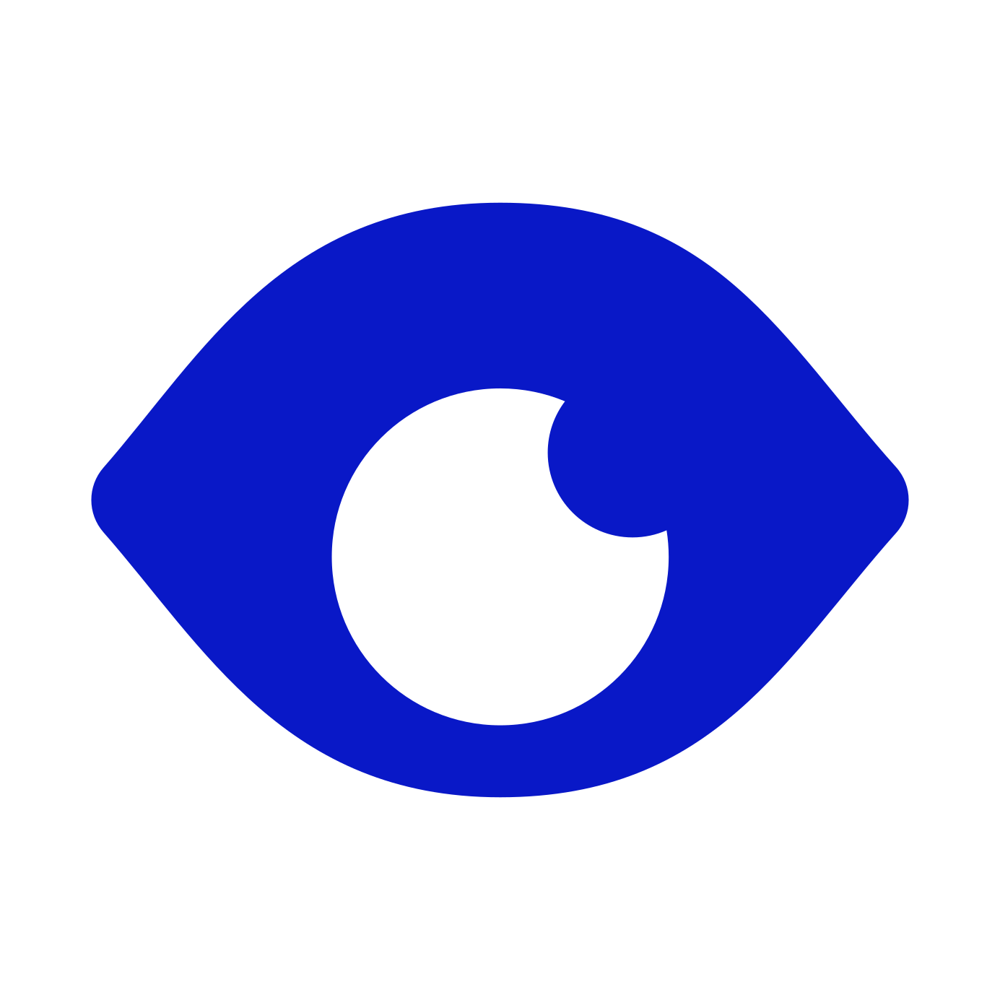

  

<h1 align="center">Eye in the Sky</h3>

<i>Keep an eye on the skies as if you were the god of meteorology.</i>

  

 
 

## **ABOUT THE PROJECT**
### **Overview**
Observe the skies and keep the weather on check.

*Find the repo [here](https://github.com/Rod-Freedom/C6-Eye_in_the_Sky).* 
<!-- *Watch our tutorial [here](https://youtu.be/SatStJGm9Fk?feature=shared)!* -->

 
 

## Table of Contents
- [License](#license)
- [Resources](#resources)
- [Get Started](#get-started)
- [Usage](#usage)
- [Demos](#demos)
- [Testing](#testing)
- [Contribute](#contribute)
- [Credits](#credits)

 

[(Back to the Top)](#about-the-project)

## Resources
* For JavaScript
    * Promises.
    * Object and array destructuring.
    * Polymorphism for methods.
    * Classes and constructors.
    * `throw new Error` to stop faulty executions.
    * `setTimeout` executions for UX.

 

[(Back to the Top)](#about-the-project)

## Get Started
*Watch our tutorial [here](https://youtu.be/SatStJGm9Fk?feature=shared)!*

 

[(Back to the Top)](#about-the-project)

## Usage
*Watch our tutorial [**here**](https://youtu.be/SatStJGm9Fk?feature=shared)!*

**Eye in the Sky** is easy and intuitive to use.

 
 

Something.

> 

 

[(Back to the Top)](#about-the-project)

## Demos
You have a ton of options to customize your logo.

You may use any shape, font or color you like!

One example without background, perfect for a header.

 

[(Back to the Top)](#about-the-project)

## License
 
See the [license](https://github.com/Rod-Freedom/C6-Eye_in_the_Sky/blob/main/LICENSE) for more details.

 

[(Back to the Top)](#about-the-project)

## Contribute
If you have suggestions or want to help with some improvements, you can write me by [email](mailto:rod@alpacaazul.mx).

 

[(Back to the Top)](#about-the-project)

## Credits
All the code was created from scratch by [Rod's Freedom](https://github.com/Rod-Freedom).

 

[(Back to the Top)](#about-the-project)